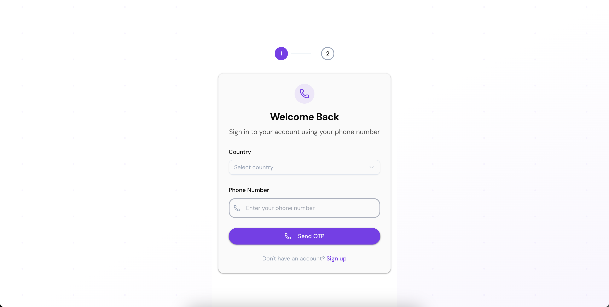
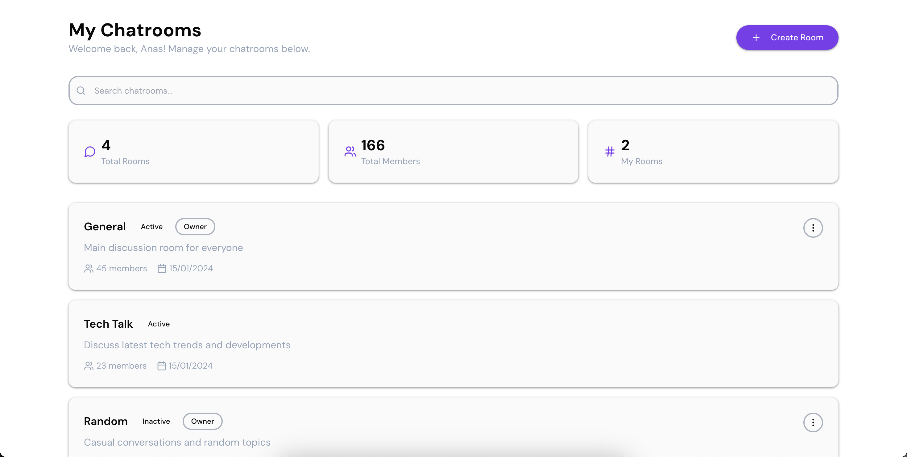
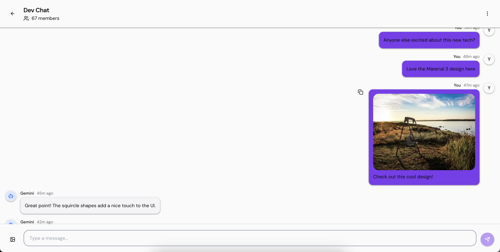

# Kuvaka Assignment - Modern Chat Application

A sophisticated real-time chat application built with Next.js 14, featuring Material 3 design principles, advanced authentication, and seamless user experience.

## 🌐 Live Demo

**[View Live Application](https://kuvaka-assignment-deployed.netlify.app/)**

## � Project Overview

This project is a modern chat application that demonstrates advanced React patterns, authentication flows, and real-time messaging capabilities. Built with performance and user experience in mind, it features:

- 🔐 **OTP-based Authentication** with phone number verification
- 💬 **Real-time Chat Interface** with AI-powered responses (Gemini AI)
- 🎨 **Material 3 Design System** with custom theming
- 📱 **Responsive Design** optimized for all devices
- ⚡ **Performance Optimized** with infinite scroll and smart loading
- 🎯 **Form Validation** with comprehensive error handling

## 🚀 Setup and Run Instructions

### Prerequisites

- Node.js 18+ installed
- npm or yarn package manager

### Installation

1. **Clone the repository**

   ```bash
   git clone https://github.com/anasaijaz/kuvaka-assignment.git
   cd kuvaka-assignment
   ```

2. **Install dependencies**

   ```bash
   npm install
   # or
   yarn install
   ```

3. **Run the development server**

   ```bash
   npm run dev
   # or
   yarn dev
   ```

4. **Open your browser**
   Navigate to [http://localhost:3000](http://localhost:3000)

### Available Scripts

- `npm run dev` - Start development server
- `npm run build` - Build for production
- `npm run start` - Start production server
- `npm run lint` - Run ESLint

## 📁 Project Structure

```
kuvaka-assignment/
├── app/                          # Next.js App Router
│   ├── (auth)/                   # Authentication routes group
│   │   ├── login/               # Login page
│   │   └── signup/              # Signup page
│   ├── (protected)/             # Protected routes group
│   │   ├── chat/[id]/           # Dynamic chat room pages
│   │   └── page.js              # Main dashboard
│   ├── globals.css              # Global styles
│   ├── layout.js                # Root layout
│   └── providers.js             # App providers
├── components/                   # Reusable UI components
│   └── ui/                      # shadcn/ui components
│       ├── button.jsx           # Custom button component
│       ├── card.jsx             # Material 3 styled cards
│       ├── input.jsx            # Form input components
│       └── ...                  # Other UI components
├── lib/                         # Utility libraries and services
│   ├── auth-hooks.js            # Authentication custom hooks
│   ├── auth-service.js          # Authentication service layer
│   ├── helpers.js               # Utility functions
│   ├── store.js                 # Zustand state management
│   ├── utils.js                 # Common utilities
│   └── validation.js            # Zod validation schemas
├── public/                      # Static assets and screenshots
└── README.md                    # Project documentation
```

### Component Architecture

#### Core Components

- **Authentication Flow**: Multi-step OTP verification with phone number validation
- **Chat Interface**: Real-time messaging with typing indicators and message status
- **Dashboard**: Chatroom management with search and filtering capabilities
- **UI Components**: Custom Material 3 themed components built on shadcn/ui

#### Key Features Implementation

##### 🔄 State Management (Zustand)

```javascript
// lib/store.js - Centralized state management
const useAppStore = create((set) => ({
  user: null,
  loading: false,
  setUser: (user) => set({ user }),
  setLoading: (loading) => set({ loading }),
}));
```

##### 🎨 Material 3 Design System

Custom implementation with:

- Elevated cards with proper shadows
- Dynamic color theming
- Typography scale
- Component variants following Material 3 guidelines

## 🛠 Technical Implementation Details

### 1. Throttling Implementation

**Chat Interface Throttling:**

- **Message Loading**: Implements throttled loading to prevent excessive API calls
- **Scroll Events**: Throttled scroll detection for infinite scroll trigger
- **User Input**: Debounced search functionality in chatroom list

```javascript
// Throttled scroll handling for infinite scroll
const handleScroll = useCallback(() => {
  // Throttling logic with 100ms delay
  scrollTimeoutRef.current = setTimeout(() => {
    const isNearTop = container.scrollTop <= 10;
    if (isNearTop) {
      loadMoreMessages();
    }
  }, 100);
}, [loadMoreMessages]);
```

### 2. Pagination Strategy

**Smart Pagination System:**

- **Reverse Pagination**: Loads older messages from the end of the dataset
- **Page-based Loading**: 20 messages per page for optimal performance
- **State Persistence**: Maintains pagination state across navigation

```javascript
// Pagination implementation
const loadMoreMessages = useCallback(async () => {
  const allMessages = allMessagesRef.current;
  const startIndex = Math.max(
    0,
    allMessages.length - (page + 1) * MESSAGES_PER_PAGE
  );
  const endIndex = allMessages.length - page * MESSAGES_PER_PAGE;
  const olderMessages = allMessages.slice(startIndex, endIndex);

  setMessages((prev) => [...olderMessages, ...prev]);
  setPage((prev) => prev + 1);
}, [page]);
```

### 3. Infinite Scroll Implementation

**Intersection Observer Based:**

- **Automatic Loading**: Triggers when "Load More" button enters viewport
- **Scroll Position Restoration**: Maintains user's reading position
- **Performance Optimized**: Uses Intersection Observer API for better performance

```javascript
// Intersection observer for infinite scroll
useEffect(() => {
  const observer = new IntersectionObserver(
    (entries) => {
      const [entry] = entries;
      if (entry.isIntersecting && hasMoreMessages && !loading) {
        loadMoreMessages();
      }
    },
    {
      root: messagesContainerRef.current,
      rootMargin: "50px",
      threshold: 0.1,
    }
  );

  observer.observe(loadMoreElement);
}, [hasMoreMessages, loading, loadMoreMessages]);
```

### 4. Form Validation System

**Zod + React Hook Form Integration:**

- **Schema-based Validation**: Type-safe validation with Zod schemas
- **Real-time Feedback**: Instant validation feedback
- **Multi-step Forms**: Comprehensive OTP flow validation

```javascript
// Validation schemas (lib/validation.js)
export const phoneSchema = z.object({
  countryCode: z.string().min(1, "Country code is required"),
  phoneNumber: z
    .string()
    .min(10, "Phone number must be at least 10 digits")
    .regex(/^\d+$/, "Phone number must contain only digits"),
});

// Form implementation with validation
const phoneForm = useForm({
  resolver: zodResolver(phoneSchema),
  defaultValues: {
    countryCode: "",
    phoneNumber: "",
  },
});
```

**Validation Features:**

- **Phone Number Validation**: International format support with country codes
- **OTP Verification**: 6-digit code validation with resend functionality
- **Profile Validation**: Email format and name validation
- **Real-time Error Display**: Immediate feedback on form errors

### 5. Advanced Chat Features

**AI Integration:**

- **Typing Indicators**: Real-time typing status with animated dots
- **Message Status**: Delivery and read receipts
- **Smart Scrolling**: Auto-scroll for new messages, position preservation for history

**Message Management:**

- **Copy to Clipboard**: One-click message copying
- **Image Support**: Upload and display images with preview
- **Message Persistence**: Local storage for offline capability

## 📱 Screenshots

### Authentication Flow


_OTP-based authentication with phone number verification_

### Dashboard


_Chatroom management with search and filtering_

### Chat Interface


_Real-time messaging with AI responses_

## 🎯 Key Features Demonstrated

### Performance Optimizations

- **Lazy Loading**: Components and routes loaded on demand
- **Image Optimization**: Next.js Image component with automatic optimization
- **Bundle Splitting**: Automatic code splitting for optimal loading
- **Memory Management**: Proper cleanup of event listeners and timeouts

### User Experience

- **Smooth Animations**: CSS transitions and animations throughout the app
- **Loading States**: Comprehensive loading indicators and skeleton screens
- **Error Handling**: User-friendly error messages and recovery options
- **Accessibility**: Keyboard navigation and screen reader support

### Development Best Practices

- **TypeScript Ready**: Structured for easy TypeScript migration
- **Component Reusability**: Modular component architecture
- **Custom Hooks**: Reusable logic extraction
- **Clean Code**: Well-documented and maintainable codebase

## 🔧 Technologies Used

- **Frontend**: React 18, Next.js 14 (App Router)
- **Styling**: Tailwind CSS, shadcn/ui, Material 3 Design
- **State Management**: Zustand
- **Form Handling**: React Hook Form + Zod validation
- **HTTP Client**: Axios with SWR for data fetching
- **Icons**: Lucide React
- **Notifications**: React Hot Toast
- **Image Handling**: Next.js Image optimization

## 🚀 Deployment

The application is deployed on Netlify with:

- **Automatic Deployments**: Connected to main branch
- **Environment Variables**: Configured for production
- **CDN Distribution**: Global content delivery
- **HTTPS**: Secure connection with SSL certificate

## � License

This project is created as part of a technical assignment and is available for educational purposes.

---

**Created with ❤️ for Kuvaka Assignment**
